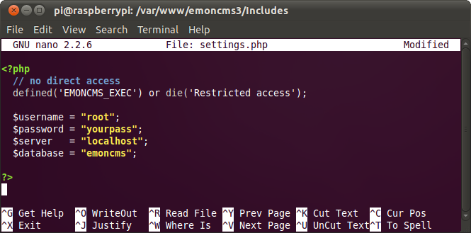
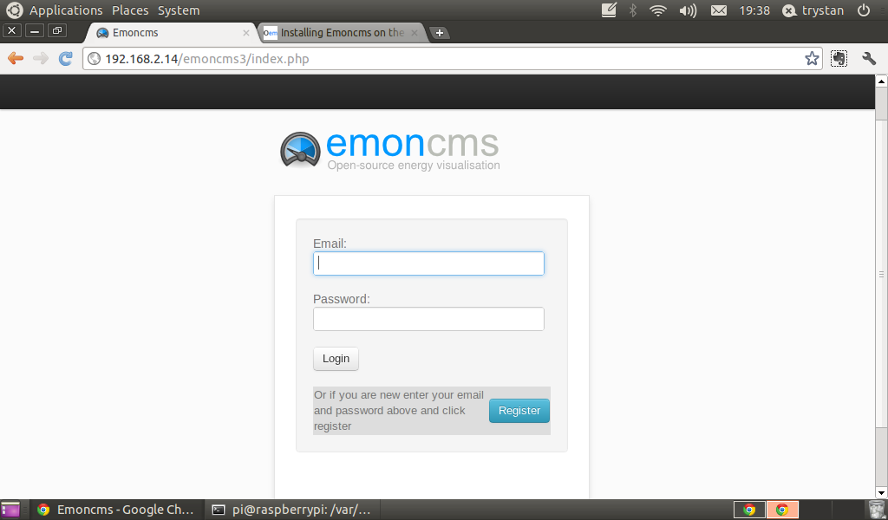

## Install Emoncms on Ubuntu / Debian / Raspberry PI

This installation guide was create when installing emoncms on the PI with a blank install of raspbian “wheezy”, however as the raspbian wheezy is based on debian this guide should work on most debian systems including Ubuntu.

#### 1) Install mysql

    $ sudo apt-get install mysql-server mysql-client

When the blue dialog appears enter a password for root user, note the password down as you will need it later.

#### 2) Install apache2

    $ sudo apt-get install apache2

#### 3) Install php

    $ sudo apt-get install php5 libapache2-mod-php5
    $ sudo apt-get install php5-mysql

#### 4) Enable mod rewrite

    $ sudo a2enmod rewrite
    $ sudo nano /etc/apache2/sites-enabled/000-default

Change (line 7 and line 11), "AllowOverride None" to "AllowOverride All".
[Ctrl + X ] then [Y] then [Enter] to Save and exit.

#### 5) That completes the server installation, restart the server to make everything above operational:

    $ sudo /etc/init.d/apache2 restart

### Installing emoncms:
#### 6) Install git (optional)
$ sudo apt-get install git-core
Follow this tutorial on creating keys etc:

[https://help.github.com/articles/generating-ssh-keys](https://help.github.com/articles/generating-ssh-keys)

Helpful tip: If doing this via SSH use *$ cat /home/pi/.ssh/id_rsa.pub* to display the SSH key in the terminal window. then select and [Ctrl + Shift + C] to copy to clipboard ready to paste into Github setting page. 

#### 7) Download Emoncms

First cd into the var directory:

    $ cd /var/

Set the permissions of the www directory to be owned by the pi username:

    $ sudo chown pi www

Cd into www directory

    $ cd www

Download old stable emoncms using git:

    $ git clone git://github.com/emoncms/emoncms.git

Alternatively download emoncms and unzip to your server:

[https://github.com/emoncms/emoncms](https://github.com/emoncms/emoncms)

#### 8) Create a MYSQL database

    $ mysql -u root -p

Enter the mysql password that you set above.
Then enter the sql to create a database:

    mysql> CREATE DATABASE emoncms;

Exit mysql by:

    mysql> exit

#### 9) Set emoncms database settings.

cd into the emoncms directory where the settings file is located

    $ cd /var/www/emoncms/

Make a copy of default.settings.php and call it settings.php

    $ cp default.settings.php settings.php

Open settings.php in an editor nano works great on the pi:

    $ nano settings.php

How nice is the syntax highlighting on the pi!!:

Enter in your database settings.

Save (Ctrl-X), type Y and exit

#### 10) In an internet browser, load emoncms:

[http://localhost/emoncms](http://localhost/emoncms)

The first time you run emoncms it will automatically setup the database and you will be taken straight to the register/login screen. 

Create an account by entering your email and password and clicking register to complete.

#### 11) PHP Suhosin module configuration (Optional - Debian 6)

Dashboard editing needs to pass parameters through HTTP-GET mechanism and on Debian 6 the max
allowable length of a single parameter is very small (512 byte). This is a problem for designing of dashboard
and when you exceed this threshold all created dashboard are lost...

to overcame this problem modify "suhosin.get.max_value_length" in /etc/php5/conf.d/suhosin.ini" to large
value (8000, 16000 should be fine).

#### (Optional) Enable Multi lingual support using gettext

Follow the guide here step 4 onwards: [http://openenergymonitor.org/emon/emoncms/using-gettext-on-ubuntu](http://openenergymonitor.org/emon/emoncms/using-gettext-on-ubuntu)
