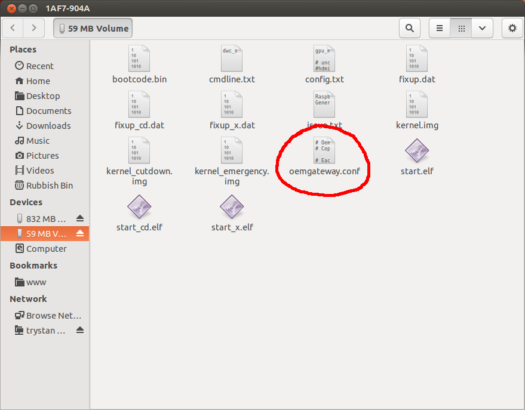
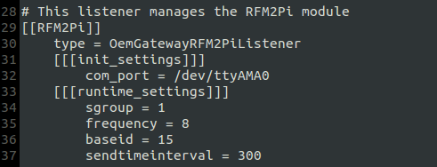
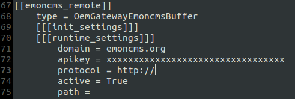
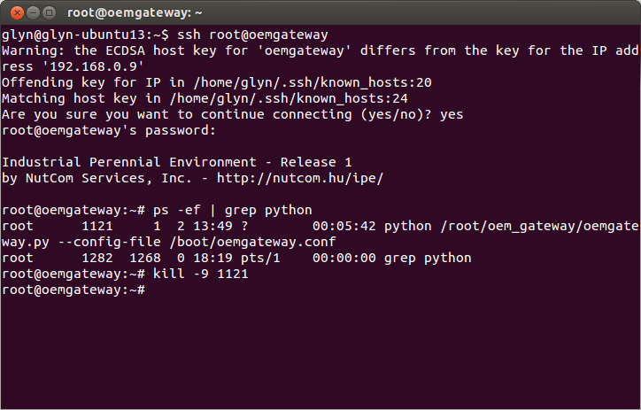
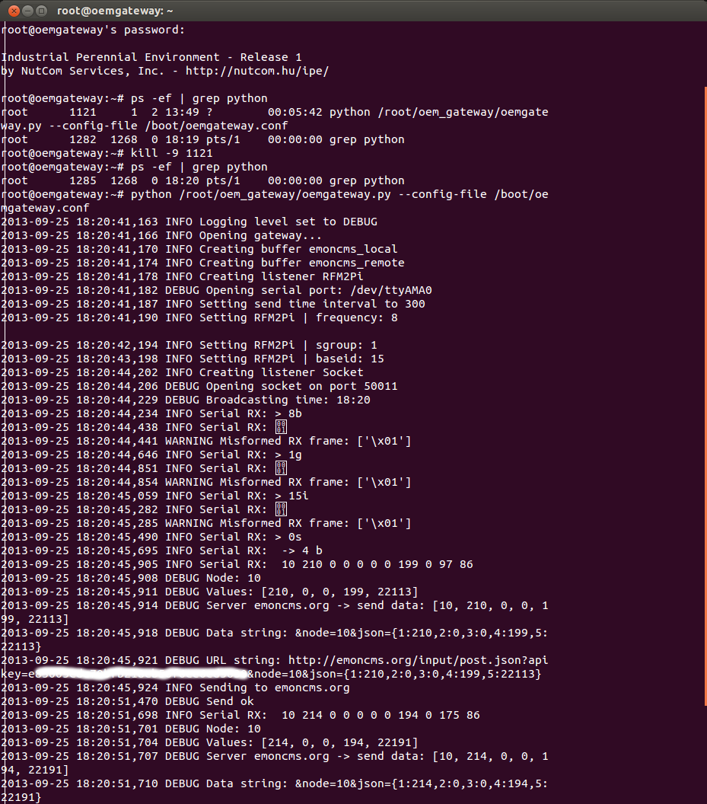

# RaspberryPI Gateway

This is a reliable solution which is simple to setup and works well if you just want to forward data to a remote emoncms server like emoncms.org.

It uses a read only file system approach as developed by Martin Harizanov which means its not susceptible to the SD Card failure issue from too many writes:

[http://harizanov.com/2013/08/rock-solid-rfm2pi-gateway-solution/](http://harizanov.com/2013/08/rock-solid-rfm2pi-gateway-solution/)

It uses Jerome Lafréchoux's exellent python oem_gateway to forward the data to emoncms.org, or other remote server.

[https://github.com/Jerome-github/oem_gateway](https://github.com/Jerome-github/oem_gateway)

## 1) Download the ready-to-go SD card image:

Download pre-prepared image:

#### [oem_gateway24sep2013.img.zip](https://docs.google.com/file/d/0B7G0lHyW4GQbNWFHRXhUdHg1bGs/edit?usp=sharing)

## Alternatively build it yourself:

[http://emoncms.org/site/docs/raspberrypigatewaybuild](http://emoncms.org/site/docs/raspberrypigatewaybuild)

## 2) Write the image to an SD card

### Linux

Start by inserting your SD card, your distribution should mount it automatically so the first step is to unmount the SD card and make a note of the SD card device name, to view mounted disks and partitions run:

    $ df -h

You should see something like this:

    Filesystem            Size  Used Avail Use% Mounted on
    /dev/sda6             120G   90G   24G  79% /
    none                  490M  700K  490M   1% /dev
    none                  497M  1.7M  495M   1% /dev/shm
    none                  497M  260K  497M   1% /var/run
    none                  497M     0  497M   0% /var/lock
    /dev/sdb1             3.7G  4.0K  3.7G   1% /media/sandisk

Unmount the SD card, change sdb to match your SD card drive:

    $ umount /dev/sdb1 

If the card has more than one partition unmount that also: 

    $ umount /dev/sdb2

Locate the directory of your downloaded emoncms image in terminal and write it to an SD card using linux tool *dd*:

<i class='icon-fire'></i> <b>Warning:</b> take care with running the following command that your pointing at the right drive! If you point at your computer drive you could lose your data!

    $ sudo dd bs=4M if=raspberrypi_gateway.img of=/dev/sdb

### Windows 

The main raspberry pi sd card setup guide recommends Win32DiskImager, see steps for windows here: 
[http://elinux.org/RPi_Easy_SD_Card_Setup](http://elinux.org/RPi_Easy_SD_Card_Setup)
Select the image as downloaded above.

### Mac OSX 

See steps for Mac OSX as documented on the main raspberry pi sd card setup guide:
[http://elinux.org/RPi_Easy_SD_Card_Setup](http://elinux.org/RPi_Easy_SD_Card_Setup)
Select the image as downloaded above.
  

## 3) Configure oemgateway settings in SD Card 59Mb boot partition

Open oemgateway.conf found in the SD Card boot partition:

The first part to configure it the group and frequency of the rfm12pi.
The group and frequency set here needs to be the same as used on any sensor nodes.

For the frequency setting: 8 used as shorthand for 868Mhz and 4 for 433Mhz. 

The second part to configure is the apikey of your remote server account, if its emoncms.org thats all you need to add here. If your posting to another server you will need to set the domain and you may need to set the path if the emoncms installation is in a sub-directory.

## 4) Plug in the RFM12Pi Expansion module

PLug the RFM12Pi hardware expansion module onto the Pi's GPIO pins taking care to align up pin 1, the RFM12Pi should be connected to the GPIO pins connector closest to the edge of the pi. 

It's best to plug in the RFM12Pi before you power up the Pi, as the Pi sends configuration settings to the RFM12Pi on bootup.

## 5) Power it up!

Thats it, if you have sensor nodes sending data, inputs should start appearing in your emoncms account.

Return to the OpenEnergyMonitor Guide to setup your sensor nodes and map the inputs in emoncms: 
[http://openenergymonitor.org/emon/guide](http://openenergymonitor.org/emon/guide)

## Recommended Steps

We recomend you change the default password for the Pi. To do this we need to take control of the Pi over SSH. The are many tutorials on how to SSH into a pi on the interent, here we will assume you are using a linux terminal. The default username and password is 'root' and root':

	$ ssh root@oemgateway
	password: root 

The hostname 'oemgateway' usually works on most network configuritions, if you have trouble connecting try the Pi's local IP address (obtained from your router) instead. Once logged in the first recomended step is to change the password:

	$ passwd 

and set your timezone, the default in Europe/London

	$ dpkg-reconfigure tzdata

## Troubleshooting 

The first point of call for troubleshooting is to view the output of the python oem_gateway script. This is set to run at boot as a background task. To view the output of the script we first need to kill it:

	$ ps -ef | grep python

will return something like this:

We are looking for the process ID of the python script (PID) in my case this is '1119'. 

We can now kill this process with the line, replacing 1119 with the PID of your python script process:

	$ kill -9 1119

To restart the script as a foreground process so we can view it's output run 

	$ python /root/oem_gateway/oemgateway.py --config-file /boot/oemgateway.conf

You should now see output like the following

"DEBUG Serial Rx: " followed by a string of numbers means data has been received from another node, this should be followed by

"DEBUG Node: 10" this means data has been received from Node with ID 10 (by default this is an emonTx), see bottom of [this page](http://openenergymonitor.org/emon/buildingblocks/rfm12b2) for default node ID allocation

"DEBUG Send ok" means the data has been succesfully posted to emoncms

To stop the script hit [CTRL + C]

To restart the script as a background process it's easiest just to reboot the Pi

	$ sudo reboot

